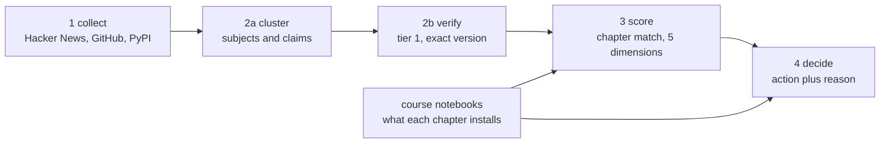

# AI Trend Agent

An agent that reads what shipped in the AI ecosystem this week, checks every claim against
the official release that would have to confirm it, then compares the confirmed versions
with what our own course notebooks install. It follows every package the course installs,
because that watchlist is read out of the material rather than typed by us.

It does not report news. It reports what our material teaches that no longer exists, and
what employers ask for that the course does not teach yet. A version number is evidence,
never the reason on its own.

## What it found

The agent checked every `langchain` import in the 89 course notebooks against the source of
**langchain 1.4.2**, the release a student installs today, read file by file at its tag on
GitHub. It then looked for each missing name in the packages LangChain moved code into, so the
replacement it proposes was read from a release too.

- **85 import lines in 39 notebooks across 11 chapters** name something 1.4.2 no longer has:
  `AgentExecutor` and `create_react_agent` (38 notebooks), `PromptTemplate` (21 lines), `hub`
  (14), and the old memory and chain classes.
- **One notebook breaks on today's install.** `Demo_LangChain_Document_Chat` in C8 installs
  `langchain` with no bound and still has `from langchain.chains import RetrievalQA` in cell 88.
  It now lives in `langchain_classic.chains`.
- **The other 38 run as written**, because they pin `langchain==0.3.*` or `<1.0`. They teach
  the 0.3 agent API, which 1.x replaced with `create_agent`. That is one decision for the whole
  course, not an edit per chapter, so the agent recommends investigating a larger change.

Every edit names the notebook, the cell, the current line and the proposed one, with a link to
the file at the release tag that proves it.

It also reads what the tools grew. langchain 1.4.2 has a module the course's 0.3.30 does not:
`langchain.mcp`, "LangChain MCP adapters for connecting MCP servers with LangChain
applications" in its own docstring. **20 job posts named MCP in the last three months, and none
of the 89 notebooks mentions it**, so the agent recommends a new lesson on it.

## How it decides

Each stage reads the previous JSON artifact and writes the next one into
`fixtures/runs/<run_id>/`. Only stage 1 touches the network, so every later stage replays
offline from a saved run.

**A claim is confirmed only when a tier-1 source states the same subject at the same exact
version.** Three rules keep that honest:

1. An official release or the PyPI registry can confirm. A discussion post never can.
2. Versions are extracted and compared with `==`. An early bug let `1.5` be "confirmed" by
   `v11.5.0` because it used a substring test.
3. A claim is never confirmed by the document it was read from, and the verdict records what
   kind of check it was: `primary_report` when the release states its own version,
   `registry_match` when GitHub and PyPI both carry it, and `cross_source` only when something
   said elsewhere is confirmed by an official release. Two registries run by the same project
   are not independent, so they do not get to count as a cross-source check.

**It decides the way a school would, not the way a changelog does.** Most of what ships is
not teachable: of 2,120 lines in the release notes of the frozen run, four in five are fixes or
chores. So the agent reads the notes and sorts every line into breaking, deprecation,
feature, fix or chore, the judge is shown what changed rather than the version number, and
market demand comes from real job posts and real installs rather than from how much a tool
is discussed.

**A chapter is only called stale when the distance can be measured and it matters.** The
verdict comes from what the notebooks install and what the releases changed:

| What the scan finds | Verdict |
|---|---|
| A notebook imports a name the newest release removed, and installs with no bound | rewrite: it does not run on today's install |
| The same import, in a notebook that pins the old line | an edit for the day the course moves |
| A major release since the pinned version | rewrite: semver says a major breaks things |
| A minor gap, and the notes show a breaking change or a new concept | rewrite |
| A minor gap, and the notes show only fixes and chores | watch: the pinned notebook still runs |
| No bound, and the releases add something the chapter should teach | rewrite |
| No bound, and nothing read shows a change worth teaching | watch, and pin the version |
| The tool is not stable enough to teach: maturity 2 of 5 or less | watch, unless a removed import breaks the course's own notebook |
| Notebooks in two or more chapters import names the newest release removed | investigate a larger change: one decision for the course |
| No chapter, and employers ask for it | a new lesson |
| No chapter, some employers ask for it, and the releases add something to teach | optional content |
| No chapter, and no employer asks for it | watch |

Every recommendation carries a two or three step action plan, in English and Arabic, built
from the same facts: which lines to change, what to pin, what the release added.

**How much it matters and how ready we are to teach it are scored apart.** Priority is the
mean of relevance, impact, educational value and market demand. Feasibility is the mean of the
three factors the brief names, each measured from data the run holds:

- **maturity**, from the package's whole history on PyPI: a year old, three years old, a 1.0
  or later release, and no breaking change or pre-release in this run;
- **prerequisites**: 5 when the course teaches the package, 4 when it teaches its family or
  something the package builds on, otherwise unmeasured, since finding no link is not finding
  a gap;
- **difficulty**, 1 to 5: for existing material, the import lines to change and how many
  chapters they reach, plus breaking changes; new material starts at 3.

Folded into the priority, an easy version pin outranked a real change, so feasibility stays
beside it. A tool at maturity 2 or below is watched whatever else it scores, the brief's own
test for watching. Every card shows both numbers, and each factor says what it came from.

### Where the model is allowed to decide

A model reads discussion posts, rates how much a change matters for teaching, and writes the
recommendation sentence. **It never decides what counts as evidence.** The verification gate
is rules, and no model output can turn a claim into `confirmed`.

The writer is checked too. If the sentence it returns drops the facts it was given, the
version or the name of a removed API, the sentence is refused and the rules text is used
instead. The run log says so when it happens.

## Numbers from the frozen run

`run_20260922T102800Z` travels with the repo, so anyone can replay it with no network.

| | |
|---|---|
| Signals collected | 407 over the same 30 days: 235 Hacker News, 93 PyPI and 79 GitHub |
| Packages followed | 56, every one the course notebooks install |
| Subjects tracked | 37 |
| Checkable claims | 148 |
| Confirmed by the release itself | 121 |
| Carried by a second registry | 24 |
| Confirmed by an independent source | 0 |
| Unverified | 3 |
| Release-note lines read | 2,120: 8 breaking, 2 deprecations, 370 features, 795 fixes, 945 chores |
| Job posts searched | the last three "Ask HN: Who is hiring?" threads |
| Recommendations | 4 update a chapter, 1 course-wide change, 2 new lesson, 2 optional, 28 watch |
| Import lines to change | 85 in 39 notebooks, checked against langchain 1.4.2; 3 break today |
| Concepts the course does not teach | MCP, a new lesson: 20 job posts, 0 of 89 notebooks |
| Teaching feasibility | 3.3 to 5.0 of 5; 2 tools watched as not stable enough to teach |
| Written reasons | 33 of 37 by the model, checked for the facts; 4 by the rules |
| Chapters with something to act on | 11 of 25 |
| Tests | 372, none of which calls a model or the network |

Cross-source is zero because no discussion post this week stated anything a release page
could check. That is a property of the data, not a gap in the checker, and the page prints
the zero rather than folding it into the column beside it. Adding PyPI did not quietly fix
it either: two registries run by the same project agreeing is recorded as `registry_match`,
never passed off as independent support.

## Setup

    python -m venv .venv
    source .venv/Scripts/activate
    pip install -r requirements.txt
    pytest

PowerShell uses `;` between commands and `.\.venv\Scripts\python.exe`; Git Bash uses `&&`
and `.venv/Scripts/python.exe`.

To switch the model on, put a key in `.env`, and name the providers to try in order:

    GROQ_API_KEY=gsk_...
    MODEL_ORDER=groq-fast,groq

`OPENAI_API_KEY` and `NVIDIA_API_KEY` work the same way. Without a key the stages fall back
to rules and say so on the page.

## Running it

### The web app

    python -m uvicorn web.server:app --port 8800

Open http://localhost:8800. Pick a saved run, press **Run now** to collect this week live,
or **Re-analyse** to replay the saved signals of the selected run without touching the
network. The stages report what they are thinking while they work.

### One command, no browser

    python -m src.pipeline                       # live: collect and analyse
    python -m src.pipeline --run-id run_2026...  # replay saved signals, no network

### The offline page

    python -m web.site --run-id run_2026...

Writes `web/dist/site.html` with the run and its fonts embedded. It opens on any machine
with no server and no network, and it is what we present from if the wifi dies.

Every card's reason is on the page in English and Arabic. The Arabic is built from rules,
never the model, so it carries the same versions, dates and counts as the English.

## Reading the course into the agent

The agent cannot say a chapter is behind unless it knows what that chapter runs. That comes
from the notebooks themselves.

    python -m src.curriculum

Put each week's material in `notebooks/week <n>/` first. The scan records, per chapter, the
version bound each `pip install` line carries, the packages installed with no bound at all,
and every `langchain` import checked against the newest release (`src/material.py`). That
check reads GitHub and PyPI; `--offline` skips it and keeps the edits already recorded.
`notebooks/` is gitignored: the course files stay on your machine, and the edits travel in
`fixtures/curriculum.json`.

    python -m src.notebooks --by-week    # what the scan sees, before it is written
    python -m src.pin                    # what each chapter is recorded as running

## Layout

    src/       the agent: schema, run I/O, the five stages, the model adapter
    web/       the website: builder, FastAPI server, template, styles
    fixtures/  curriculum.json and the frozen demo run
    docs/      progress, tuning notes, demo answers, the per-member plans
    notebooks/ the course material, read locally and never committed

## Team

| Member | Owns |
|---|---|
| Abdulmajeed Salmeen | Schema, run I/O, stage 4, pipeline, web server, dashboard, repo |
| Ali Almufarriji | Stage 1, collecting signals from Hacker News, GitHub and PyPI |
| Abdulrhman Almania | Stage 2a, clustering signals into subjects and extracting claims |
| Naif Alasmari | Stage 2b verification, and stage 3 scoring |

Built for the SDA Agentic AI Bootcamp capstone, 2026.

## Further reading

- [`docs/DEMO-QA.md`](docs/DEMO-QA.md) answers the hard questions, each from the frozen run.
- [`docs/PROGRESS.md`](docs/PROGRESS.md) holds the live state, the decisions and why each was
  taken.
- [`docs/TUNING.md`](docs/TUNING.md) records the measured comparison of TF-IDF against
  sentence embeddings for clustering.
