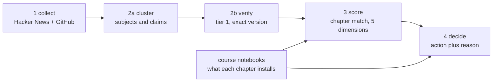

# AI Trend Agent

An agent that reads what shipped in the AI ecosystem this week, checks every claim against
the official release that would have to confirm it, then compares the confirmed versions
with what our own course notebooks install.

It does not report news. It reports what our material teaches that no longer exists.

## What it found

Chapter C8 teaches document QA on LangChain across eight notebooks.

- Seven install `langchain` with **no version bound at all**.
- One pins `langchain==0.0.352` and `openai==0.28`.
- The code calls `RetrievalQA`, `LLMChain`, `load_qa_chain` and `openai.ChatCompletion`.

All four are gone in 1.x. The newest confirmed release is **langchain 1.4.2**. A student who
opens that notebook today installs 1.4.2, and the material does not run.

The rest of the course pins `langchain==0.3.*`, `langchain-openai==0.2.*` and
`langgraph==0.2.*`, one major version behind every confirmed release in the run.

## How it decides

Each stage reads the previous JSON artifact and writes the next one into
`fixtures/runs/<run_id>/`. Only stage 1 touches the network, so every later stage replays
offline from a saved run.

**A claim is confirmed only when a tier-1 source states the same subject at the same exact
version.** Three rules keep that honest:

1. An official release can confirm. A discussion post never can.
2. Versions are extracted and compared with `==`. An early bug let `1.5` be "confirmed" by
   `v11.5.0` because it used a substring test.
3. A claim is never confirmed by the document it was read from. Evidence from a different
   document is `cross_source`; the release speaking about itself is `primary_report`.

**A chapter is only called stale when the distance can be measured.** The verdict comes from
what the notebooks actually install:

| What the scan finds | Verdict |
|---|---|
| A major or minor release since the pinned version | worth rewriting |
| Only patch releases since | leave it alone |
| No version bound in the notebook | no guarantee, a student installs whatever shipped that day |
| Nothing recorded | say so, do not call the chapter stale |

### Where the model is allowed to decide

A model reads discussion posts, rates how much a change matters for teaching, and writes the
recommendation sentence. **It never decides what counts as evidence.** The verification gate
is rules, and no model output can turn a claim into `confirmed`.

The writer is checked too. If the sentence it returns drops the facts it was given, the
version or the name of a removed API, the sentence is refused and the rules text is used
instead. The run log says so when it happens.

## Numbers from the frozen run

`run_20260919T152501Z` travels with the repo, so anyone can replay it with no network.

| | |
|---|---|
| Signals collected | 393, being 313 Hacker News and 80 GitHub releases |
| Subjects tracked | 17 |
| Checkable claims | 82 |
| Confirmed by the release itself | 80 |
| Confirmed by an independent source | 0 |
| Unverified | 2 |
| Recommendations | 4 update a chapter, 4 new lesson, 9 watch |
| Course notebooks read | 89, across six weeks |
| Chapters installing something with no version bound | 19 of 25 |
| Tests | 149, none of which calls a model or the network |

Cross-source is zero because no discussion post this week stated anything a release page
could check. That is a property of the data, not a gap in the checker, and the page prints
the zero rather than folding it into the column next to it.

## Setup

    python -m venv .venv
    source .venv/Scripts/activate
    pip install -r requirements.txt
    pytest

PowerShell uses `;` between commands and `.\.venv\Scripts\python.exe`; Git Bash uses `&&`
and `.venv/Scripts/python.exe`.

To switch the model on, put a key in `.env`:

    OPENAI_API_KEY=sk-...

Without it the stages fall back to rules and say so on the page.

## Running it

### The web app

    python -m uvicorn web.server:app --port 8800

Open http://localhost:8800. Pick a saved run, press **Run now** to collect this week live,
or **Re-analyse** to replay the saved signals of the selected run without touching the
network. The stages report what they are thinking while they work.

### One command, no browser

    python -m src.pipeline                       # live: collect and analyse
    python -m src.pipeline --run-id run_2026...  # replay saved signals, no network

### The offline page

    python -m web.site --run-id run_2026...

Writes `web/dist/site.html` with the run and its fonts embedded. It opens on any machine
with no server and no network, and it is what we present from if the wifi dies.

## Reading the course into the agent

The agent cannot say a chapter is behind unless it knows what that chapter runs. That comes
from the notebooks themselves.

    python -m src.curriculum

Put each week's material in `notebooks/week <n>/` first. The scan records, per chapter, the
version bound each `pip install` line carries, the packages installed with no bound at all,
and the API calls a later major release removed. `notebooks/` is gitignored: the course
files stay on your machine.

    python -m src.notebooks --by-week    # what the scan sees, before it is written
    python -m src.pin                    # what each chapter is recorded as running

## Layout

    src/       the agent: schema, run I/O, the five stages, the model adapter
    web/       the website: builder, FastAPI server, template, styles
    fixtures/  curriculum.json and the frozen demo run
    docs/      progress, tuning notes, demo answers, the per-member plans
    notebooks/ the course material, read locally and never committed

## Team

| Member | Owns |
|---|---|
| Abdulmajeed Salmeen | Schema, run I/O, stage 4, pipeline, web server, dashboard, repo |
| Ali Almufarriji | Stage 1, collecting signals from Hacker News and GitHub |
| Abdulrhman Almania | Stage 2a, clustering signals into subjects and extracting claims |
| Naif Alasmari | Stage 2b verification, and stage 3 scoring |

Built for the SDA Agentic AI Bootcamp capstone, 2026.

## Further reading

- [`docs/DEMO-QA.md`](docs/DEMO-QA.md) answers the hard questions, each from the frozen run.
- [`docs/PROGRESS.md`](docs/PROGRESS.md) holds the live state, the decisions and why each was
  taken.
- [`docs/TUNING.md`](docs/TUNING.md) records the measured comparison of TF-IDF against
  sentence embeddings for clustering.
